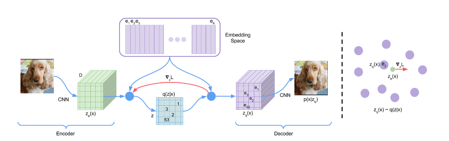
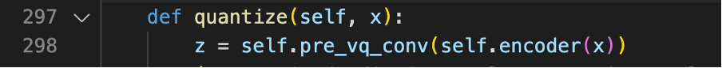
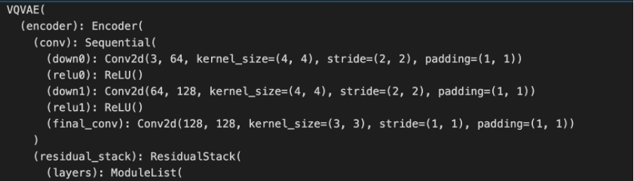
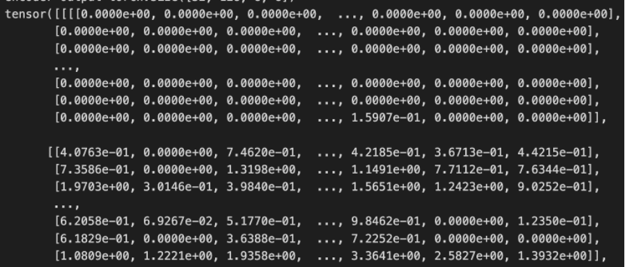
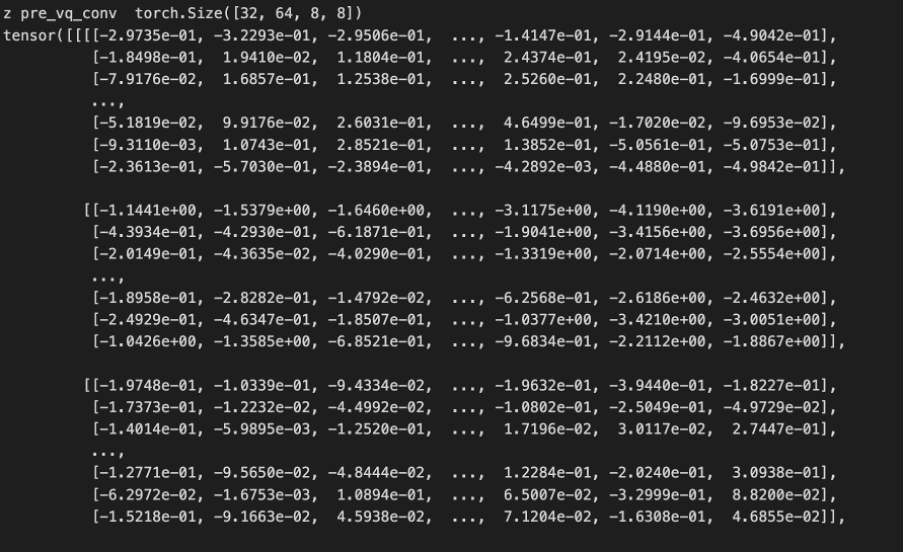
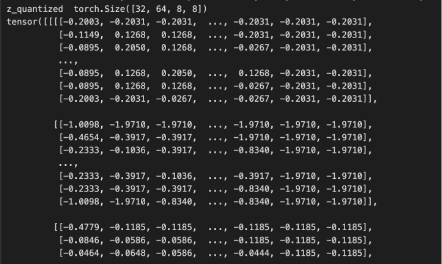
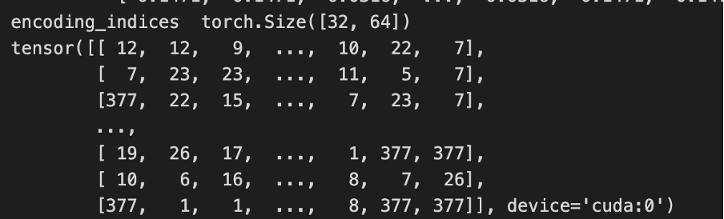

# Neural Discrete Representation Learning

-   [Link](https://arxiv.org/abs/1711.00937)
-   [Practice Code](https://github.com/airalcorn2/vqvae-pytorch)

1. 저자가 뭘 해내고 싶어했는가?

-   Latent Vector를 discrete vector로 표현
-   Discrete vector를 decoder에 넣어 image reproduction 잘 해내기

2. 이 연구의 접근에서 중요한 요소는 무엇인가?

-   encoder가 생성한 continuous vector를 embedding space(codebook)를 참고하여 discrete vector로 매핑하고 decoder 입력으로 넣기

3. 당신(논문독자)은 스스로 이 논문을 이용할 수 있는가?

-   Encoder에서 나온 continuous vector를 codebook에 존재하는 embedding vector와 매핑하는데, 이 vector들을 클러스터로 생각할 수 있음.
-   Deepsketch에 적용하기 위해 unsupervised learning에서 데이터 블록을 적절하게 분류하는 과정으로 적용(codebook의 embedding vector에 매핑)

4. 당신이 참고하고 싶은 다른 레퍼런스에는 어떤 것이 있는가?

-   VQ-VAE로 classification을 할 수 있는가?

### How VQ-VAEs differ from traditional VAEs

-   Latent vector from encoder is discrete vector (VAE is continuous vector)
-   Referring to the embedding space(codebook), map the latent vector to a discrete vector and input it to the decoder.

### How does VQ-VAE work?

-   Convert the image to a discrete vector and reproduce the discrete vector back to the image

### How des Encoder(VQ-VAE) work?

-   Image passes through the Conv Layer and turns into a feature map

-   Encoder structure
    

-   Encoder Output
    

-   pre_vq_conv
    

-   z_quantized (refer to embedding space)
    

-   encoding indices
    
